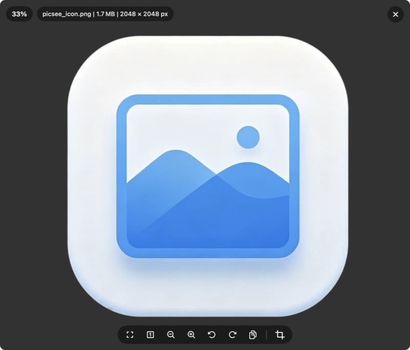
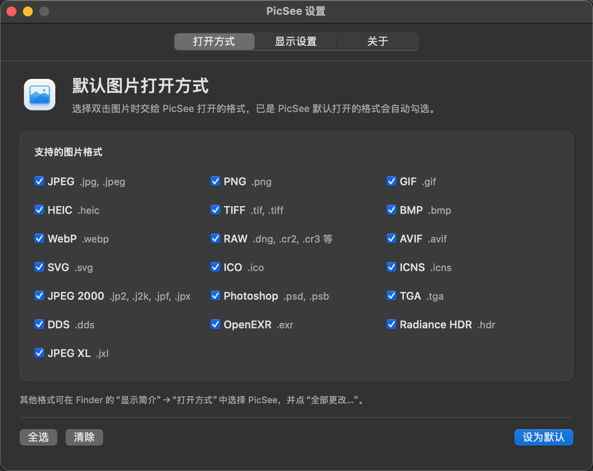

# PicSee

PicSee 是一个面向 macOS 的轻量级图片查看器，主打“Finder 双击即开、看完即退”。它支持滚轮缩放、键盘切图、OCR 选字复制、图片裁剪与标注，并同时兼容 Apple Silicon 与 Intel 芯片。

## 首次打开窗口

未启用固定窗口时，小图按原始像素和当前屏幕倍率换算窗口内容尺寸，不再统一撑到屏幕高度的 80%。大图按比例缩小，窗口宽、高通常不超过可用区域的 80%，预留菜单栏、Dock 和标题栏空间，并居中打开。初始窗口的最小内容尺寸为 800 × 600 点，打开后仍可手动缩小窗口；较小屏幕优先保证初始最小尺寸，但以可用空间为限。启用固定窗口后仍优先恢复已保存的窗口大小和位置。

无标题栏模式仅调整外观：关闭窗口阴影，去掉信息浮层、导航按钮和工具栏的装饰性描边与投影，以及工具栏按钮的常驻底色；保留半透明底色与按下反馈。有标题栏模式保留原有系统窗口控制和浮层样式。

## 项目背景

macOS 自带的「预览」在快速看图时有两处常见不便：**鼠标滚轮无法缩放**，且**关闭窗口后主进程仍留在 Dock**，往往需要再手动退出一次。PicSee 正是为化解这些摩擦而做：在轻量前提下，提供 **滚轮缩放**、**`Esc` 退出**，以及**关闭窗口即结束当前应用实例**的一气呵成体验；并在此基础上集成了实用的 **OCR 文字复制**（拖选图片中的文字、`Cmd + C` 复制）。

## 应用预览

PicSee 提供简洁的无边框看图界面，可直接查看图片信息，并通过底部工具栏完成全屏、原始尺寸、缩放、旋转、复制，以及图片裁剪与标注等操作。

点击旋转按钮右侧的复制按钮，可将当前整张图片按原始像素尺寸复制到系统剪贴板，保留当前旋转方向，方便粘贴到其他应用。成功后显示“已复制到剪贴板”，提示约 2 秒后自动消失。

<p align="center">
  
</p>

### 设置为默认图片查看器

内置的默认打开方式设置窗口支持 JPEG、PNG、GIF、HEIC、TIFF、BMP、WebP 及常见 RAW 格式，可按需选择希望交给 PicSee 打开的图片类型。文件夹浏览也支持 AVIF、SVG、ICO/ICNS、JPEG 2000、PSD/PSB、TGA、DDS、EXR/HDR 和 JPEG XL；专业格式是否能完整解码取决于当前 macOS 的 ImageIO 解码器及文件内嵌预览。

<p align="center">
  
</p>

## 功能

- Finder 双击图片直接打开
- 可按图片格式将 PicSee 设置为默认图片查看器
- 多窗口独立查看，关闭一个窗口只退出当前进程
- 整图复制：点击旋转右侧的复制按钮，将当前图片按原始像素尺寸复制到剪贴板，保留旋转方向，成功后提示“已复制到剪贴板”
- 图片裁剪：在当前窗口框选、移动选区、调整边角，或直接输入宽高精确裁剪；移动选区时像素尺寸保持不变
- 截图标注：支持箭头、矩形、椭圆、多行文字、画笔、荧光笔、直线、圆形马赛克和橡皮擦；支持撤销 / 重做、复制截图与按比例保存，适配浅色和深色模式
- 滚轮缩放图片
- 放大后拖动图片空白区域可平移图片
- 鼠标移动到文字区域时显示 I 形光标，可拖选并复制图片中文字
- `Cmd + C` 复制当前选中的图片文字
- `← → ↑ ↓` 切换同目录图片
- 切图顺序跟随 Finder 当前显示顺序（需授权自动化权限）；无法读取时安全回退到文件名顺序
- 双击图片进入或退出 macOS 原生全屏
- `Esc` 关闭当前图片并退出应用
- 右键菜单支持复制图片路径、切换跟随系统 / 浅色 / 深色主题
- 右键「移到废纸篓」或 `⌘⌫` 删除当前图片，自动切到下一张（末尾则切到上一张）；支持 `⌘Z` 或右键「撤销移到废纸篓」逐次恢复。本次窗口关闭前均可撤销，恢复时不会覆盖同名文件。删完后显示空文件夹提示，可撤销或退出
- 删除前默认显示确认框，回车或 Escape 取消；确认删除时勾选「以后不再询问」可关闭后续确认，重启应用后仍生效

## 运行环境

- macOS 14 及以上
- Xcode Command Line Tools 或完整 Xcode
- Swift 6

## 本地开发

先运行测试：

```bash
swift test
```

本地构建应用：

```bash
Scripts/build-app.sh
```

构建完成后会得到：

- App Bundle: `build/PicSee.app`
- 本地安装副本: `~/Applications/PicSee.app`

如果只想构建，不自动安装到本机应用目录：

```bash
PICSEE_SKIP_LOCAL_INSTALL=1 Scripts/build-app.sh
```

指定版本号构建：

```bash
PICSEE_VERSION=0.2.53 PICSEE_BUILD_NUMBER=54 Scripts/build-app.sh
```

## 生成 DMG 安装包

安装包使用紧凑的拖拽安装窗口：左侧 PicSee、右侧 Applications，中间为三个浅灰色圆角箭头，底部显示安装说明。窗口布局与 Retina 背景由打包脚本自动生成，本地构建与 GitHub Actions 使用同一份配置。

需要 Python 3.10 或更高版本；首次构建会在 `build/dmg-tools` 创建隔离环境，安装 `Scripts/dmg-requirements.txt` 中固定版本的 dmgbuild 及依赖。后续构建复用此环境，不修改系统 Python。布局参数位于 `Scripts/dmg-settings.py`，背景绘制位于 `Scripts/dmg-background.swift`。

生成 DMG：

```bash
Scripts/build-dmg.sh
```

构建完成后会得到：

- DMG: `build/dmg/PicSee-0.2.53.dmg`

同样可以指定版本号：

```bash
PICSEE_VERSION=0.2.53 Scripts/build-dmg.sh
```

可运行 `bash Tests/build-dmg-tests.sh` 检查打包参数传递，运行 `bash Tests/verify-dmg.sh build/dmg/PicSee-0.2.53.dmg` 挂载并验证实际安装包的应用签名、应用内容与构建产物一致、Applications 链接、背景和图标布局。GitHub Actions 会在公证前执行安装包验证。

## 使用方式

### 1. 从 Finder 打开

把 PicSee 设为默认图片查看器后，直接在 Finder 中双击图片即可打开。

### 2. 基本交互

- 拖动顶部标题区域：移动窗口
- 滚动鼠标滚轮：放大 / 缩小图片
- 双击图片：在适合窗口状态下进入或退出原生全屏；已缩放或平移时恢复适合窗口
- 放大后拖动非文字区域：移动图片可视区域
- 光标移到可识别文字上：显示 I 形光标，可拖选文字
- `Cmd + C`：复制选中的文字
- `Esc`：关闭当前窗口并退出当前实例

### 3. 切图

- `←` / `↑`：上一张
- `→` / `↓`：下一张

Finder 能通过系统脚本接口返回可靠顺序时，PicSee 会按该顺序切图。首次查询时，系统会弹出一次自动化授权请求；无法可靠读取时，PicSee 会立即使用文件名顺序，不阻塞翻页。

**回退到文件名排序的情况：**
- 未授权自动化权限
- Finder 窗口未打开或找不到对应文件夹
- 列视图（Column View）或画廊视图（Gallery View）
- 列表视图按"日期添加"排序
- Finder 使用分组或其他脚本接口无法可靠描述的排列方式
- 查询超时或失败

回退时使用文件名的自然排序（localized standard compare），与 Finder 的"按名称排序"一致。

### 4. 图片裁剪与标注

点击底部工具栏右侧的截图按钮，即可直接在当前图片窗口裁剪和标注。

**裁剪选区**

1. 在图片上按住鼠标拖动，框选需要保留的区域。
2. 使用“调整选区”工具拖动选区内部移动位置，拖动边角控制点调整大小；在选区外拖动可重新框选。
3. 在工具栏右侧输入宽、高像素，选框会实时调整。例如输入 `300 × 300` 后，移动选区仍保持这个尺寸。

首次框选作为编辑起点，不计入撤销记录；后续标注和调整可使用撤销 / 重做按钮，或 `Cmd + Z` / `Cmd + Shift + Z`。

**添加标注**

- 箭头、矩形、椭圆和直线：选择工具后拖动绘制，单击不会生成箭头。
- 画笔和荧光笔：选择快捷颜色、常用粗细，或点击当前粗细数值打开滑条自定义。
- 马赛克：按住鼠标以圆形画刷涂抹，可选择常用直径或通过数值按钮打开滑条调整。
- 文字：选择 `T` 后点击选区输入，透明蓝框随内容自动扩展；回车换行，点击框外确认，`Esc` 取消本次修改。使用文字或调整选区工具时，悬停已确认文字会显示手形，拖动可移动位置，双击可重新编辑。
- 橡皮擦：点击或拖动删除已有标注。

字号、线条粗细和马赛克直径以当前屏幕显示大小为准，不会因图片显示比例不同而忽大忽小。工具栏只显示当前工具需要的参数。

**复制与保存**

点击右上角的复制图标，将裁剪与标注结果复制到剪贴板；成功后会在窗口中央短暂显示“已复制到剪贴板”。点击绿色对勾打开保存窗口，导出为 PNG。点击红色叉号或在未编辑文字时按 `Esc` 退出截图。

蓝色选框上方实时显示选区的像素宽高，底部保留可编辑尺寸；尺寸标签在窗口边缘自动保持可见。

鼠标进入截图工具面板时恢复标准箭头，返回图片区域后恢复选择指针。

截图默认文件名为 `picsee-截图-yyyyMMdd-HHmmss-SSS.png`，使用打开保存窗口时的本地时间，精确到毫秒。

保存窗口以单选按钮展示两种尺寸选项，每项直接显示输出像素，默认选择“按选择尺寸保存”，并在原图尺寸选项的像素数值后标注“当前显示比例”，与查看器显示一致：

| 保存尺寸 | 输出规则 |
| --- | --- |
| 按选择尺寸保存 | 按屏幕实际像素输出（显示逻辑尺寸 × 屏幕倍率），与工具栏宽高、复制图片一致 |
| 按原图尺寸保存 | 按选区对应的原图像素输出 |

例如 2 倍 Retina 屏幕上 600 × 400 逻辑点的选框，底部显示 1200 × 800 px，复制和按选择尺寸保存都直接输出 1200 × 800 像素，不再放大后缩小。屏幕尺寸导出与复制使用线性采样，避免在较小显示比例下额外平滑文字笔画。调整窗口或切换不同倍率的屏幕时，选区像素尺寸随显示尺寸和屏幕倍率更新。按原图尺寸保存始终输出原图选区像素。

### 5. 删除与恢复图片

- 右键选择「移到废纸篓」，或按 `Cmd + Delete`，将当前原文件移到系统废纸篓。
- 默认显示确认框：左侧「取消」、右侧「移到废纸篓」；回车或 `Esc` 取消。确认删除时勾选「以后不再询问」可关闭后续确认，取消操作不会保存这一偏好。
- 删除后继续显示下一张；后面没有可浏览图片时回到上一张。删完后显示空文件夹提示，可撤销或退出。
- 点击成功提示中的「撤销」、右键选择「撤销移到废纸篓」，或按 `Cmd + Z`，可逐次恢复本次窗口中删除的图片。窗口关闭前均可撤销，恢复时不会覆盖原位置的同名文件。
- 截图标注期间不响应原图删除快捷键，长按删除快捷键不会连续删除多张图片。

## GitHub Actions 自动打包 DMG 并发布 Release

仓库内已经包含工作流：

- Workflow: `.github/workflows/release.yml`

这个工作流会在 **推送版本标签** 时自动：

1. 检出代码
2. 构建 Universal 2 的 `PicSee.app`
3. 打包生成 `dmg`
4. 创建对应的 GitHub Release
5. 把 `dmg` 作为 Release 附件上传

### 触发方式

先提交代码并推送：

```bash
git push origin master
```

再创建版本标签并推送：

```bash
git tag v0.2.53
git push origin v0.2.53
```

工作流会自动生成：

- Release: `v0.2.53`
- Asset: `PicSee-0.2.53.dmg`

## Release 说明

工作流默认使用 Developer ID 证书签名并提交 Apple notarization；如果未配置
证书 secrets，则自动回退到 **Ad-hoc 签名**（跳过 notarization），DMG 仍
会正常上传和发布。

### 配置证书（可选，用于正式发行）

如需使用 Apple 公证签名（用户打开时不会出现 Gatekeeper 拦截），需要在仓库
Settings → Secrets 中配置：

- `MACOS_CERTIFICATE_BASE64`
- `MACOS_CERTIFICATE_PASSWORD`
- `KEYCHAIN_PASSWORD`
- `APPLE_ID`
- `APPLE_TEAM_ID`
- `APPLE_APP_PASSWORD`

## 项目结构

```text
Sources/PicSee/App/         应用生命周期、窗口管理、打开图片路由
Sources/PicSee/Navigation/  同目录图片导航
Sources/PicSee/Viewer/      图片显示、缩放、OCR 选字、键盘交互
Scripts/                    本地构建脚本（app / dmg）
Tests/PicSeeTests/          单元测试与 OCR 回归测试
```
