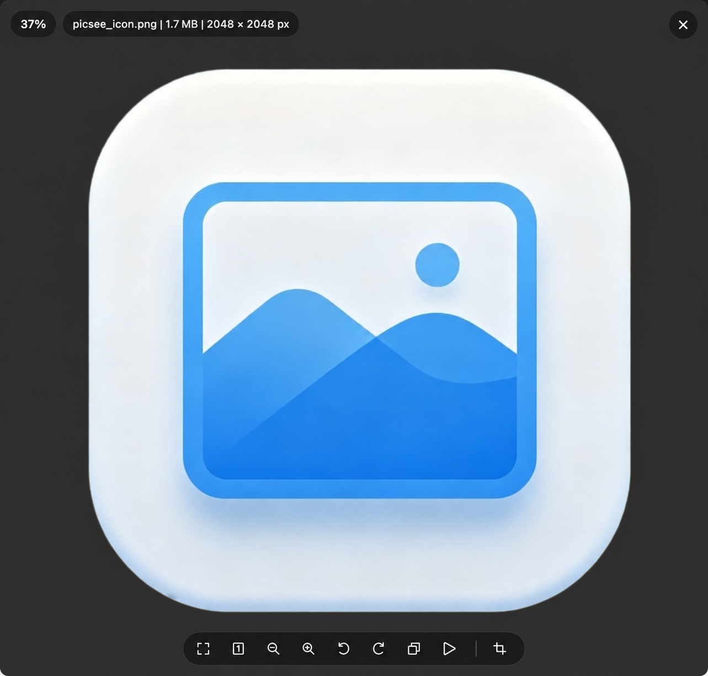
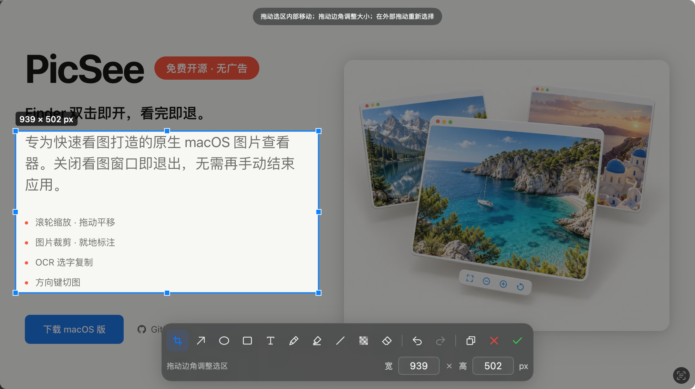
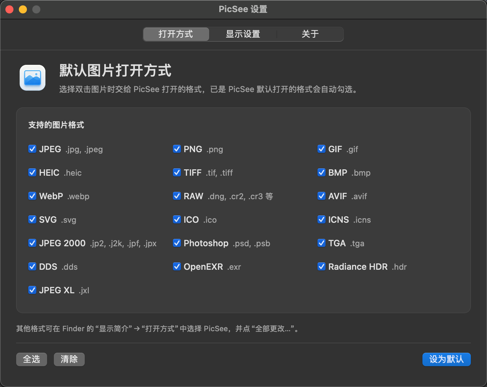

# PicSee

PicSee 是一个面向 macOS 的轻量级图片查看器，主打“Finder 双击即开、看完即退”。它支持滚轮缩放、键盘切图、OCR 选字复制、图片裁剪与标注，并同时兼容 Apple Silicon 与 Intel 芯片。

## 首次打开窗口

未启用固定窗口时，小图按原始像素和当前屏幕倍率换算窗口内容尺寸，不再统一撑到屏幕高度的 80%。大图按比例缩小，窗口宽、高通常不超过可用区域的 80%，预留菜单栏、Dock 和标题栏空间，并居中打开。初始窗口的最小内容尺寸为 800 × 600 点，打开后仍可手动缩小窗口；较小屏幕优先保证初始最小尺寸，但以可用空间为限。启用固定窗口后仍优先恢复已保存的窗口大小和位置。

无标题栏模式仅调整外观：关闭窗口阴影，去掉信息浮层和导航按钮的装饰性描边与投影。有标题栏模式保留原有系统窗口控制和浮层样式。两种模式的看图工具栏统一采用半透明底色、细描边和轻阴影，按钮在悬停或按下时提供反馈。

## 项目背景

macOS 自带的「预览」在快速看图时有两处常见不便：**鼠标滚轮无法缩放**，且**关闭窗口后主进程仍留在 Dock**，往往需要再手动退出一次。PicSee 正是为化解这些摩擦而做：在轻量前提下，提供 **滚轮缩放**、**`Esc` 退出**，以及**关闭窗口即结束当前应用实例**的一气呵成体验；并在此基础上集成了实用的 **OCR 文字复制**（拖选图片中的文字、`Cmd + C` 复制）。

## 应用预览

**升级提示：** 已安装 v0.2.65～v0.2.68 的用户，请从 [v0.2.69 发布页面](https://github.com/houleixx/PicSee/releases/tag/v0.2.69) 手动下载 DMG 并替换应用一次。这些旧版本的更新器存在签名校验参数错误，相关公开安装包已撤下；v0.2.69 已修复。

PicSee 提供简洁的无边框看图界面，可直接查看图片信息，并通过底部工具栏完成适合窗口、原始尺寸、缩放、旋转、复制，以及图片裁剪与标注等操作。

看图时按 `⌘←` 向左旋转 90°，按 `⌘→` 向右旋转 90°；每按一次继续旋转，四次回到原方向。隐藏工具栏时仍可使用，文字输入、截图编辑及弹窗期间不触发；长按不连续旋转，普通方向键继续用于翻页。

点击旋转按钮右侧的复制按钮，可将当前整张图片按原始像素尺寸复制到系统剪贴板，保留当前旋转方向，方便粘贴到其他应用。成功后显示“已复制到剪贴板”，提示约 2 秒后自动消失。

<p align="center">
  
</p>

### 拖拽保存图片

在图片上按住鼠标，拖出 PicSee 窗口后，放到桌面、Finder 文件夹或支持文件拖放的应用中，即可复制当前图片，无需按 Option。窗口内仍保持原来的平移行为；离开图片边缘或进入窗口留白不会导出。鼠标需距按下位置移动至少 12 点，并越过整个窗口外边界至少 12 点，才开始系统文件拖拽。

无标题栏时，从顶部拖动仍然移动窗口，从右下角或左上角拖动仍然调整窗口大小。文字选择、缩略导航图和截图编辑继续使用各自原有的拖动操作。系统文件拖拽开始后，本次手势由系统接管，取消不会修改原图。

本地图片优先使用原始文件，保留文件名、扩展名和原始内容，包括 GIF 动画；查看时的缩放和旋转不会写入副本。临时来源会复制到系统临时目录，只有内存图像可用时会导出为 PNG。临时导出文件在后续启动或导出时清理：保留至少 24 小时，并跳过仍在运行的来源进程，避免接收方尚未读取就被删除。目前查看入口仍为本地文件，尚未增加网络 URL、Blob 或剪贴板图片的导入入口。

启动和拖拽触发的过期文件清理由后台串行执行，不阻塞菜单初始化或拖拽文件准备；同一目录的重复清理请求在上次清理完成后 60 秒内合并。

全屏或窗口贴住屏幕边缘时，鼠标可能无法越过窗口边界；可先缩小窗口，或使用现有的“图片另存为…”功能。

实现与验证范围见[拖拽保存验证记录](docs/verification/2026-09-13-image-file-drag.md)。

### 图片截图与标注

点击看图工具栏最右侧的截图按钮，或按 `⌘⇧A`，即可在当前图片上框选区域，拖动选区或边角调整位置和大小，也可以输入宽、高进行精确裁剪。

编辑工具栏提供箭头、矩形、椭圆、文字、画笔、荧光笔、直线、马赛克和橡皮擦，可调整颜色、粗细、字号与马赛克直径，并支持撤销 / 重做。完成后点击复制按钮将结果放入剪贴板，或点击绿色对勾保存为 PNG。

<p align="center">
  
</p>

### 设置为默认图片查看器

右键选择“设置…”或按 `⌘,` 会打开统一设置窗口的“显示设置”页，可在窗口顶部切换到“打开方式”和“关于”；应用菜单仍保留“默认打开方式…”和“关于 PicSee”快捷入口，复用同一设置窗口。直接启动 PicSee 时进入“打开方式”页。显示设置页可调整主题、标题栏、缩略图、文件信息、工具栏、图片参数、单窗口看图、窗口置顶以及固定窗口；修改立即生效，与保留的右键菜单双向同步，并沿用已有偏好记忆。多个 PicSee 进程之间也会同步这些浏览偏好。

“显示设置 → 语言”可选择“跟随系统”“简体中文”或“English”，切换立即生效、无需重启，并同步到其他 PicSee 进程。切换保留当前图片、缩放、旋转和截图编辑状态。菜单、应用弹窗、导出选项和工具提示均支持中英文；macOS 自身管理的文件面板导航及权限提示遵循系统语言设置。

右键菜单采用统一的系统图标，图片操作集中在顶部；标题栏、缩略图、文件信息、底部工具栏和图片参数开关收进“显示选项”子菜单。底部保留“设置…”与“检查更新”。

右键选择“设为桌面壁纸”，将当前图片设置为看图窗口所在屏幕的壁纸，并沿用该屏幕的系统显示方式。壁纸副本会保存在应用支持目录，移动或删除原图不影响壁纸；动态图会转为静态壁纸。

“打开方式”页可选择图片格式后点击“设为默认”；取消勾选只会排除本次设置，不会撤销已有文件关联。“关于”页可查看版本并手动检查更新，检查结果在设置内显示。启动时的自动检查不会显示“已经是最新版本了”提示。

设置中的“打开方式”页和文件夹浏览支持 JPEG、PNG、GIF、HEIC、TIFF、BMP、WebP、常见 RAW、AVIF、SVG、ICO/ICNS、JPEG 2000、PSD/PSB、TGA、DDS、EXR/HDR 和 JPEG XL，可按需选择希望交给 PicSee 打开的图片类型。批量设置会跳过已是默认的格式；个别格式失败时继续处理其他格式，并显示具体错误及实际设置结果。专业格式是否能完整解码取决于当前 macOS 的 ImageIO 解码器及文件内嵌预览。

<p align="center">
  
</p>

## 功能

- Finder 双击图片直接打开
- 可按图片格式将 PicSee 设置为默认图片查看器
- 可在设置页或右键菜单切换“窗口置顶”，默认关闭并在本地记忆。所有已有及新开的看图窗口同步生效，切换应用后仍在普通窗口之上；多个置顶窗口按正常点击顺序前后排列，不抢焦点。换图、最小化后恢复均保留置顶，系统全屏期间暂时恢复普通层级，退出全屏后按当前设置恢复。设置窗口及操作弹窗显示在置顶图片上方，不自动跨桌面跟随。
- 默认多窗口独立查看，关闭一个窗口只退出当前进程
- 可在“设置 → 显示设置 → 窗口”或右键菜单开启“单窗口看图”：后续打开的图片复用接收窗口，保留窗口位置、大小和全屏状态，重置缩放、平移、旋转、OCR 和截图状态，并按新图片所在文件夹重新建立左右翻图列表。重复打开当前图片仅激活窗口；加载失败保留原图；截图编辑中换图需先确认。批量打开只显示第一张，仍按所在文件夹浏览。开关默认关闭，切换时不关闭已有窗口。
- 整图复制：点击旋转右侧的复制按钮，将当前图片按原始像素尺寸复制到剪贴板，保留旋转方向，成功后提示“已复制到剪贴板”
- 图片裁剪：在当前窗口框选、移动选区、调整边角，或直接输入宽高精确裁剪；移动选区时像素尺寸保持不变
- 截图标注：支持箭头、矩形、椭圆、多行文字、画笔、荧光笔、直线、圆形马赛克和橡皮擦；支持撤销 / 重做、复制截图与按比例保存，适配浅色和深色模式
- 滚轮缩放图片
- 放大后拖动图片空白区域可平移图片
- 鼠标移动到文字区域时显示 I 形光标，可拖选并复制图片中文字
- `Cmd + C` 复制当前选中的图片文字
- `← → ↑ ↓` 切换同目录图片
- 切图顺序跟随 Finder 当前显示顺序（需授权自动化权限）；无法读取时安全回退到文件名顺序
- 幻灯片：自动播放当前文件夹，支持间隔调整、循环、暂停与继续；窗口和全屏均可播放
- 双击图片进入或退出 macOS 原生全屏
- `Esc` 关闭当前图片并退出应用
- 右键菜单支持复制图片路径、切换跟随系统 / 浅色 / 深色主题
- 含有透明或半透明像素的图片按需显示 Photoshop 风格的灰白棋盘格；普通照片及完全不透明的 PNG 不显示。透明度判断按图片缓存，主图、切图过渡和缩略导航图共用结果。棋盘格仅用于预览，不会写入导出的图片。
- 右键「移到废纸篓」、按 `Delete` 或 `⌘⌫` 删除当前图片，自动切到下一张（末尾则切到上一张）；支持 `⌘Z` 或右键「撤销移到废纸篓」逐次恢复。撤销记录在关闭窗口或单窗口模式成功打开另一张外部图片时清空，恢复时不会覆盖同名文件。删完后显示空文件夹提示，可撤销或退出
- 删除前默认显示确认框，回车或 Escape 取消；确认删除时勾选「以后不再询问」可关闭后续确认，重启应用后仍生效

单窗口与窗口置顶的测试及实测范围见[验证记录](docs/verification/2026-09-26-window-modes.md)。

## 运行环境

- macOS 14 及以上
- Xcode Command Line Tools 或完整 Xcode
- Swift 6

## 本地开发

先运行测试：

```bash
swift test
```

本地构建应用：

```bash
Scripts/build-app.sh
```

构建完成后会得到：

- App Bundle: `build/PicSee.app`
- 本地安装副本: `/Applications/PicSee.app`（与 DMG 拖拽安装位置一致）

本地安装需要对 `/Applications/PicSee.app` 有写入权限；脚本不会自动切换到 `~/Applications`。

如果只想构建，不自动安装到本机应用目录：

```bash
PICSEE_SKIP_LOCAL_INSTALL=1 Scripts/build-app.sh
```

指定版本号构建：

```bash
PICSEE_VERSION=0.2.69 PICSEE_BUILD_NUMBER=69 Scripts/build-app.sh
```

## 生成 DMG 安装包

安装包使用紧凑的拖拽安装窗口：左侧 PicSee、右侧 Applications，中间为三个浅灰色圆角箭头，底部显示安装说明。窗口布局与 Retina 背景由打包脚本自动生成，本地构建与 GitHub Actions 使用同一份配置。

需要 Python 3.10 或更高版本；首次构建会在 `build/dmg-tools` 创建隔离环境，安装 `Scripts/dmg-requirements.txt` 中固定版本的 dmgbuild 及依赖。后续构建复用此环境，不修改系统 Python。布局参数位于 `Scripts/dmg-settings.py`，背景绘制位于 `Scripts/dmg-background.swift`。

生成 DMG：

```bash
Scripts/build-dmg.sh
```

构建完成后会得到：

- DMG: `build/dmg/PicSee-0.2.69.dmg`

同样可以指定版本号：

```bash
PICSEE_VERSION=0.2.69 Scripts/build-dmg.sh
```

可运行 `bash Tests/build-dmg-tests.sh` 检查打包参数传递，运行 `bash Tests/verify-dmg.sh build/dmg/PicSee-0.2.69.dmg` 挂载并验证实际安装包的应用签名、应用内容与构建产物一致、Applications 链接、背景和图标布局。GitHub Actions 会在公证前执行安装包验证。

## 使用方式

### 1. 从 Finder 打开

把 PicSee 设为默认图片查看器后，直接在 Finder 中双击图片即可打开。

### 2. 基本交互

- 拖动顶部标题区域：移动窗口
- 滚动鼠标滚轮或触控板捏合：围绕事件中的光标位置放大 / 缩小图片，边缘限制内尽量保持光标下的细节不动；触控板双指滚动仍用于平移已缩放的图片
- 工具栏和键盘缩放：仍围绕视口中心
- 双击图片：在适合窗口状态下进入或退出原生全屏；已缩放或平移时恢复适合窗口
- `F` 或 `Control + Command + F`：进入 / 退出原生全屏，幻灯片播放时也可使用
- 放大后拖动非文字区域：移动图片可视区域
- 光标移到可识别文字上：显示 I 形光标，可拖选文字
- `Cmd + C`：复制选中的文字
- `Esc`：关闭当前窗口并退出当前实例
- 右键关闭手势（默认关闭）：在“设置 → 显示设置 → 窗口”开启后，按住右键向下再向右划动，松开即可关闭当前图片窗口。划动时只显示蓝色轨迹线，不显示文字提示；向下至少 10 点、向右至少 16 点即可识别，按方向趋势判断，支持斜向划动、向左下后右转及短距离圆弧转弯。普通右键点击改为松开后显示菜单；未识别的拖动不会关闭或弹出菜单，手势过程中按 `Esc` 可取消。按钮及截图编辑继续使用原有操作。

### 3. 切图

- `←` / `↑`：上一张
- `→` / `↓`：下一张

左右翻页支持双向循环：最后一张继续向后会回到第一张，第一张继续向前会回到最后一张，不显示循环提示。目录中只有一张图片时不翻页，左右箭头隐藏。

默认“跟随 Finder”：普通列表视图只读取排序字段和升降序，再批量读取本地文件信息排序，避免逐项向 Finder 查询导致超时。分栏视图读取 Finder 保存的排列规则；相同日期字段的降序分组也可使用。保存的设置可能晚于 Finder 当前状态。图标手动排列仍按位置读取。不会申请辅助功能权限。

图片立即显示，排序查询在后台执行；完成前的翻页按键会排队，完成后依次处理，避免过早翻页锁定错误的文件名顺序。读取过程不显示提示；查询失败时静默使用名称自然升序，不会在浏览中途自行换序。

翻页只自动跟随 Finder，不提供手动排序或文件夹排序偏好。在 Finder 改变排列后，重新打开看图窗口即可读取最新规则。相同字段值以名称自然升序确定稳定顺序。

首次使用 Finder 自动化且尚未决定权限时，系统会弹出授权请求；等待授权与脚本查询超时分别处理。授权结束后恢复看图窗口焦点。若已拒绝授权，可在“系统设置 → 隐私与安全性 → 自动化 → PicSee”中重新启用 Finder。

首次读取下载等受保护文件夹时，系统还可能单独请求文件夹访问权限。权限弹窗结束、图片和文件夹读取恢复后，会将发起读取的图片窗口恢复到前面；普通加载不会触发恢复，已关闭、最小化或不在当前桌面的窗口不会被拉回。读取期间主动切换到其他应用会取消这次恢复。

**自动读取的限制：**
- 找不到对应 Finder 窗口、未授权、查询失败或必要元数据缺失时，静默回退到名称自然升序。
- 画廊、自动排列的图标视图、无法识别的保存规则，以及不同分组字段和组内排序字段的组合，暂不能保证还原显示顺序，读取失败时静默回退到名称自然升序。
- 已保存的 Finder 视图信息可能滞后，自动读取不保证所有视图和系统版本完全一致。

### 幻灯片播放

点击底部工具栏的播放按钮，或右键选择「播放幻灯片」，从当前图片开始自动播放当前文件夹。沿用当前 Finder 排序，不包含子文件夹，也不会强制进入全屏。排序尚未准备好时先等待，准备好后当前图片仍会展示一个完整间隔。

- 默认每张 **5 秒**，可在播放控制条选择 **2、3、5、10 秒**；播放间隔和循环开关会记住上次选择。
- 默认按当前文件夹顺序循环播放，最后一张之后回到第一张；关闭循环后播放到末尾结束并保留当前图片。循环开关会记住上次选择。
- 播放控制条提供 **全屏播放／退出全屏** 按钮，切换时保持播放或暂停状态，动画完成后重新计时。
- **空格**暂停或继续，**方向键**手动切图并重新计时；暂停时手动切图不会自动恢复播放。
- **Esc** 结束幻灯片并停留在当前图片，再次按 Esc 按原有逻辑退出 PicSee。普通看图时空格的退出行为保持不变。
- 播放时鼠标静止约 2 秒会隐藏控制条和信息浮层，移动鼠标重新显示；指针停留在播放控制条上或暂停时保持显示。隐藏普通工具栏也不影响幻灯片控制条。
- 缩放、平移、选择文字、截图、旋转、删除确认、打开右键菜单或切到其他窗口／应用时会暂停，返回后手动继续。电脑睡眠时也会暂停。
- 自动跳过已移走或无法解码的图片，没有下一张可播放图片时结束。结束后恢复原来的工具栏及信息显示偏好。

### 4. 图片裁剪与标注

点击底部工具栏右侧的截图按钮，或在看图窗口按 `⌘⇧A`，即可直接在当前图片窗口裁剪和标注。工具栏隐藏时快捷键仍有效；截图编辑过程中重复触发不会清空已有内容。

**裁剪选区**

1. 在图片上按住鼠标拖动，框选需要保留的区域。
2. 使用“调整选区”工具拖动选区内部移动位置，拖动边角控制点调整大小；在选区外拖动可重新框选。
3. 在工具栏右侧输入宽、高像素，选框会实时调整。例如输入 `300 × 300` 后，移动选区仍保持这个尺寸。

首次框选作为编辑起点，不计入撤销记录；后续标注和调整可使用撤销 / 重做按钮，或 `Cmd + Z` / `Cmd + Shift + Z`。

**添加标注**

- 箭头、矩形、椭圆和直线：选择工具后拖动绘制，单击不会生成箭头。
- 画笔和荧光笔：选择快捷颜色、常用粗细，或点击当前粗细数值打开滑条自定义。
- 马赛克：按住鼠标以圆形画刷涂抹，可选择常用直径或通过数值按钮打开滑条调整。
- 文字：选择 `T` 后点击选区输入，透明蓝框随内容自动扩展；回车换行，点击框外确认，`Esc` 取消本次修改。使用文字或调整选区工具时，悬停已确认文字会显示手形，拖动可移动位置，双击可重新编辑。
- 橡皮擦：点击或拖动删除已有标注。

字号、线条粗细和马赛克直径以当前屏幕显示大小为准，不会因图片显示比例不同而忽大忽小。工具栏只显示当前工具需要的参数。

**复制与保存**

点击右上角的复制图标，将裁剪与标注结果复制到剪贴板；成功后会在窗口中央短暂显示“已复制到剪贴板”。点击绿色对勾打开保存窗口，导出为 PNG。点击红色叉号或在未编辑文字时按 `Esc` 退出截图。

蓝色选框上方实时显示选区的像素宽高，底部保留可编辑尺寸；尺寸标签在窗口边缘自动保持可见。

鼠标进入截图工具面板时恢复标准箭头，返回图片区域后恢复选择指针。

截图默认文件名为 `picsee-截图-yyyyMMdd-HHmmss-SSS.png`，使用打开保存窗口时的本地时间，精确到毫秒。

保存窗口以单选按钮展示两种尺寸选项，每项直接显示输出像素，默认选择“按选择尺寸保存”，并在原图尺寸选项的像素数值后标注“当前显示比例”，与查看器显示一致：

| 保存尺寸 | 输出规则 |
| --- | --- |
| 按选择尺寸保存 | 按屏幕实际像素输出（显示逻辑尺寸 × 屏幕倍率），与工具栏宽高、复制图片一致 |
| 按原图尺寸保存 | 按选区对应的原图像素输出 |

例如 2 倍 Retina 屏幕上 600 × 400 逻辑点的选框，底部显示 1200 × 800 px，复制和按选择尺寸保存都直接输出 1200 × 800 像素，不再放大后缩小。屏幕尺寸导出与复制使用线性采样，避免在较小显示比例下额外平滑文字笔画。调整窗口或切换不同倍率的屏幕时，选区像素尺寸随显示尺寸和屏幕倍率更新。按原图尺寸保存始终输出原图选区像素。

### 5. 删除与恢复图片

- 右键选择「移到废纸篓」，或按 `Delete`、前向删除键（`Fn + Delete`）或 `Cmd + Delete`，将当前原文件移到系统废纸篓。长按不会连续删除；编辑文字或使用截图工具时不触发图片删除。
- 默认显示确认框：左侧「取消」、右侧「移到废纸篓」；回车或 `Esc` 取消。确认删除时勾选「以后不再询问」可关闭后续确认，取消操作不会保存这一偏好。
- 删除后继续显示下一张；后面没有可浏览图片时回到上一张。删完后显示空文件夹提示，可撤销或退出。
- 点击成功提示中的「撤销」、右键选择「撤销移到废纸篓」，或按 `Cmd + Z`，可逐次恢复当前看图会话中删除的图片。关闭窗口或单窗口模式成功打开另一张外部图片时清空撤销记录；左右翻图不会清空。恢复时不会覆盖原位置的同名文件。
- 截图标注期间不响应原图删除快捷键，长按删除快捷键不会连续删除多张图片。

## GitHub Actions 自动打包 DMG 并发布 Release

仓库内已经包含工作流：

- Workflow: `.github/workflows/release.yml`

这个工作流会在 **推送版本标签** 时自动：

1. 检出代码
2. 构建 Universal 2 的 `PicSee.app`
3. 打包生成 `dmg`
4. 创建对应的 GitHub Release
5. 把 `dmg` 作为 Release 附件上传

### 触发方式

先提交代码并推送：

```bash
git push origin master
```

再创建版本标签并推送：

```bash
git tag v0.2.69
git push origin v0.2.69
```

工作流会自动生成：

- Release: `v0.2.69`
- Asset: `PicSee-0.2.69.dmg`

## Release 说明

工作流默认使用 Developer ID 证书签名并提交 Apple notarization；如果未配置
证书 secrets，则自动回退到 **Ad-hoc 签名**（跳过 notarization），DMG 仍
会正常上传和发布。

### 配置证书（可选，用于正式发行）

如需使用 Apple 公证签名（用户打开时不会出现 Gatekeeper 拦截），需要在仓库
Settings → Secrets 中配置：

- `MACOS_CERTIFICATE_BASE64`
- `MACOS_CERTIFICATE_PASSWORD`
- `KEYCHAIN_PASSWORD`
- `APPLE_ID`
- `APPLE_TEAM_ID`
- `APPLE_APP_PASSWORD`

## 项目结构

```text
Sources/PicSee/App/         应用生命周期、窗口管理、打开图片路由
Sources/PicSee/Navigation/  同目录图片导航
Sources/PicSee/Viewer/      图片显示、缩放、OCR 选字、键盘交互
Scripts/                    本地构建脚本（app / dmg）
Tests/PicSeeTests/          单元测试与 OCR 回归测试
```

## 性能与回归检查

正式应用在后台串行加载和验证图片，目录扫描与 Finder 排序不会阻塞看图主线程。快速连续翻页以最新请求为准，迟到的加载结果不会覆盖当前图片；外部打开失败保留原图、缩放、旋转和编辑状态。幻灯片在新图片加载完成后才开始下一个完整间隔。

首次打开图片不预取。手动翻页成功后，只预取浏览方向的下一张，并缓存刚看过的图片；停止翻页后不会继续扫描加载。预取使用独立的串行解码器，切到正在预取的图片时复用同一次加载，反向翻页不会等待无关预取。每个窗口最多缓存两张额外图片，预算为物理内存的十六分之一、最多 128 MiB，按解码像素和文件大小估算；动画和超预算图片跳过预取。外部打开、删除和恢复图片会清空缓存，文件修改或删除后不会复用缓存内容。

文件大小、图片尺寸与图片参数随图片加载取得一次，缩放、平移及语言切换不会重复读取文件。重新加载文件时会重新取得元数据。透明像素检查在加载阶段完成；OCR 在图片稳定约 120 毫秒后启动，快速翻页会取消尚未开始的识别。

截图编辑未旋转的图片复用原始像素，马赛克底图首次绘制时才生成。每次完整位图渲染限制为物理内存的八分之一，最多 512 MiB；超过限制会提示减小输出尺寸。坐标、裁剪和原图尺寸导出的像素规则不变。

分组运行 Swift 测试：

```bash
bash Scripts/test-swift.sh logic
bash Scripts/test-swift.sh ui
bash Scripts/test-swift.sh all
```

`logic` 包括加载状态、导航、编辑模型、更新回滚及文件操作回归；`ui` 包括真实窗口、呈现层、OCR、Core Image、剪贴板、Finder 脚本和跨进程／系统文件类型注册验证，需要正常的 macOS 桌面会话。桌面测试按独立进程运行 Swift Testing 套件，避免不同套件争抢应用焦点。分组定义位于 `Scripts/test-swift.sh`，也可传入 SwiftPM 的过滤和构建选项。

PR 会运行 `.github/workflows/check.yml`，检查逻辑测试、本地化、网站语言和 DMG 脚本；直接推送 master 不触发检查。版本标签触发发布工作流后，必须先通过同一检查，再构建、验证和发布安装包。

### 应用内更新

应用退出前会验证下载响应和长度、DMG、应用标识及版本，检查新应用与当前应用属于同一 Developer ID 团队，并通过系统签名与 Gatekeeper 验证，再准备同目录的替换副本。替换或启动失败时恢复旧应用，不移除 quarantine 属性。

Ad-hoc 签名的构建仍可手动安装；应用内自动替换要求当前版本和更新均具有可验证的 Developer ID 身份。安装状态和日志保存在应用所在目录的 `.PicSee-update-status` 与 `.PicSee-update.log`；失败会在下次启动提示。后台安装会等待请求更新的进程退出，避免使用固定延迟猜测退出时间。
